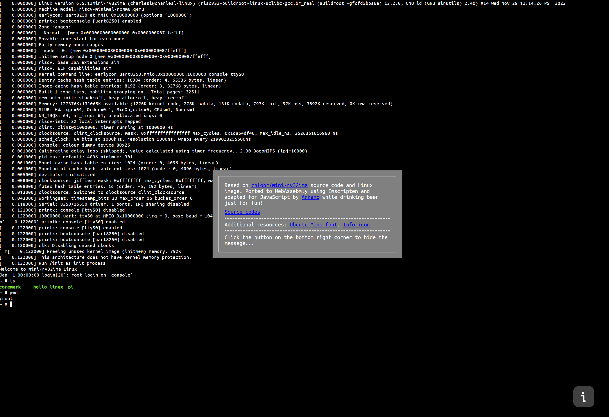

# mini-rv32ima with Linux for web!

Literally, Linux in the web browser.

Based on [cnlohr/mini-rv32ima](https://github.com/cnlohr/mini-rv32ima) source code and Linux image. Ported to WebAssebmly using Emscripten and adapted for JavaScript while drinking beer just for fun!



## How to build

1. Activate emscripten environment
2. Compile using command
```
emcc mini-rv32ima.c -o mini-rv32ima.js --preload-file Images@Images -sALLOW_MEMORY_GROWTH -sEXPORTED_FUNCTIONS=['_PerformOneCycle','_Initialize','_GetOutputBuffer','_GetOutputBufferLength','_ClearOutputBuffer','_SetInputBufferSymbol'] -O3 -s -DNDEBUG
```
3. Replace compiled files and glue-code ```mini-rv32ima-glue.js, mini-rv32ima.js, mini-rv32ima.data, mini-rv32ima.wasm``` to ```frontend/public```
4. Go to  ```frontend``` install npm dependencies (```npm install```) and build Vite project (```npm run dev```)